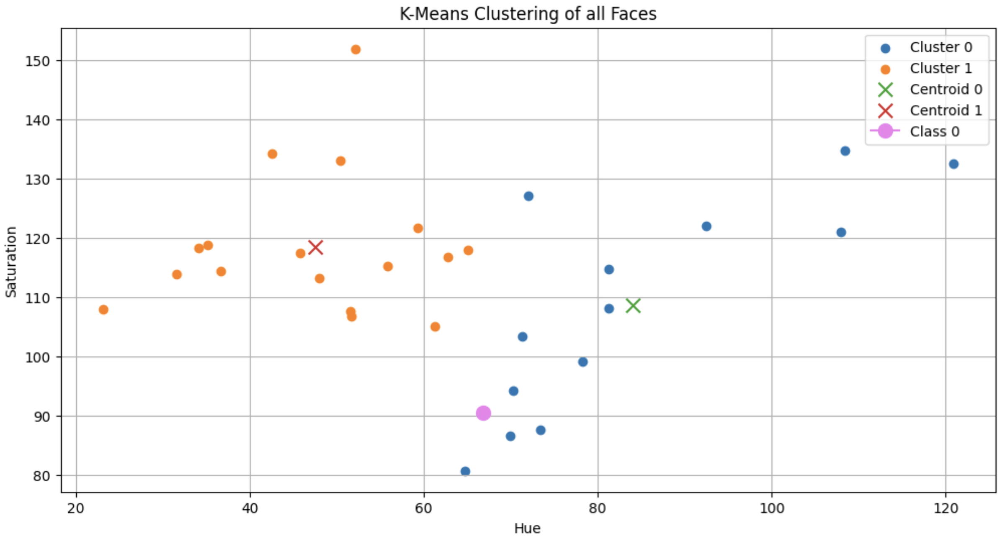

# Lab 5 – Face Clustering using K-Means

## Aim

The objective of this lab was to identify faces within an image, select two features, which were hue and saturation, and then perform a K-Means clustering on similar faces. 
The template face was then classified into one of these clusters.

## Methodology

### 1. Face Detection
OpenCV’s classifier was used to detect faces. Each detected face region was extracted for further processing.

### 2. Feature Extraction
Two features, the mean hue and saturation, were extacted from each image after it was converted to HSV colour.

These two mean values describe the average color of each face detected in the image.

### 3. K-Means Clustering
The K-Means clustering method was used with k = 2.  
Based on the Euclidean distance of the face in the feature space defined by the hue-saturation feature, the face was categorized as belonging to a certain cluster.  
The template image was categorized as belonging to a certain cluster using the K-Means model.

## Key Findings

### Face Detection Output

### Template Image

### K-Means Clustering Output

- The faces were divided into two groups based on similarity in features, namely hue and saturation.
- The template image was assigned to 'cluster 0' whose centroid was closest in that feature space.

## Conclusion
This experiment demonstrates the use of the K-Means algorithm for clustering of unsupervised data.  
Simple features were used to obtain clusters.  
